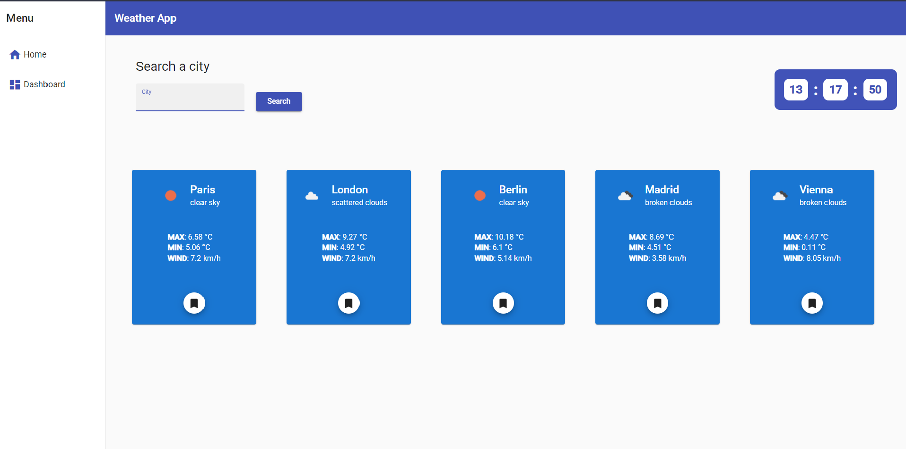

# WeatherApp

Hi everyone my name is Marcello Pascolini and here it is one of my first project built in Angular 13.2.3!

## Introduction

I built a simple meteo app using OpenWeatherMap API (https://openweathermap.org/api). My app allows you searching a city and get info about:
- Weather Description
- Minimum temperature
- Maximum temperature
- Wind Speed

I built a component called Dashboard where you can add your favorite cities and order them from A-Z (reversed also) and for min and max temperature.
In the home component you find a simple clock created using DatePipe and setInterval (the interval is stopped when component is destroyed).
While the clock isn't ready you can see a spinner running.

I manage with services the following process:
- Http Request
- Passing data between components
- Ordering data in Dashboard componeny

## Technologies

I used Angular (13.2.3) and Angular Material to emprove UX/UI

## Layout

